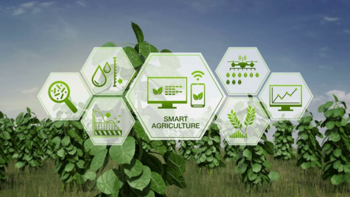
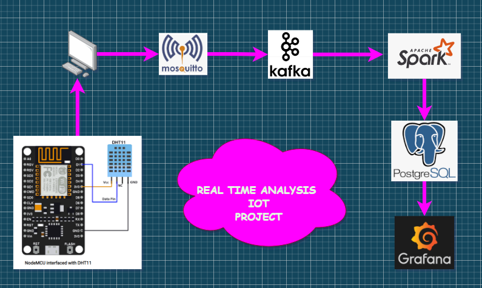

# Real-Time-Iot-Analysis

In this project, I received the ambient temperature and humidity data with the DHT11 sensor. It can be used in smart homes, smart cities and smart farming.

### Data Pipeline

